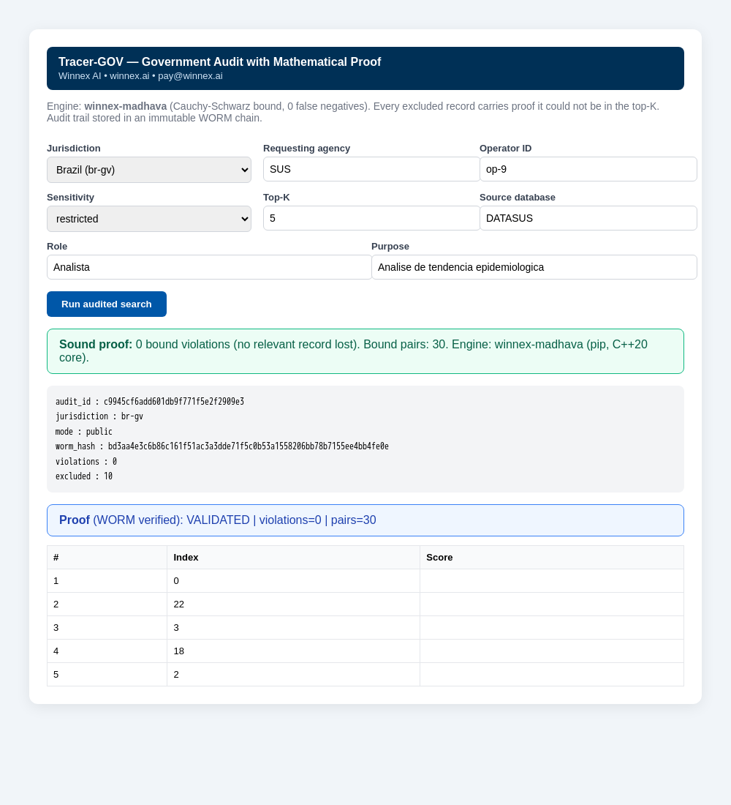

# Tracer-GOV for Liferay

**Winnex AI | Klenio Padilha**
Winnex Brasil Solucoes Empresariais LTDA - CNPJ 58.364.637/0001-47
Contact: **pay@winnex.ai** | Website: **https://winnex.ai**
License: **Business Source License 1.1 (BSL 1.1)**


---

## For developers

This README is written for the **developer who will integrate Tracer-GOV**
into a Liferay project (or call the engine from any JVM/Python service). It
shows, with working code:

- How to **start** the engine.
- How to **call the API** (cURL).
- How to **consume the OSGi service** from a Liferay module.
- How to **read the mathematical proof** and the audit trail.

For the product/end-user perspective, see [USER_GUIDE.md](docs/USER_GUIDE.md).

---

## What you get

| Component | What it does for you |
|---|---|
| **`tracer-gov-service`** (FastAPI, port 8601) | The engine: audited search with Cauchy-Schwarz proof + WORM audit trail |
| **`winnex-tracer-gov-api`** (OSGi) | The public interface (`TracerGovService`) you `@Reference` |
| **`winnex-tracer-gov-service`** (OSGi) | HTTP bridge from Liferay to the FastAPI engine (configurable, API key) |
| **`winnex-tracer-gov-portlet`** (OSGi) | Ready-made UI: jurisdiction form + government metadata + proof |

---

## 1. Start the engine

```bash
# 1. Configure the API key (copy the example, edit the value)
cp tracer-gov-service/.env.example tracer-gov-service/.env

# 2. Start
docker compose up -d

# 3. Verify
curl -s http://localhost:8601/v1/health
# {"status":"ok","engine":"tracer-gov + winnex-madhava 1.8.8",...}
```

---

## 2. Call the API (cURL)

### Build an index (once per jurisdiction)

```bash
curl -X POST http://localhost:8601/v1/tracer/build \
  -H "Content-Type: application/json" \
  -H "X-API-Key: <your-key>" \
  -d '{
    "vectors": [[0.1, -0.3, ...], [0.2, 0.1, ...]],
    "jurisdiction": "br-gv"
  }'
```

Response:
```json
{
  "status": "built",
  "jurisdiction": "br-gv",
  "N": 30,
  "dim": 32,
  "engine": "tracer-gov + winnex-madhava 1.8.8"
}
```

### Audited search (with government metadata)

```bash
curl -X POST http://localhost:8601/v1/tracer/search \
  -H "Content-Type: application/json" \
  -H "X-API-Key: <your-key>" \
  -d '{
    "query": [0.05, 0.2, ...],
    "k": 5,
    "jurisdiction": "br-gv",
    "requesting_agency": "SUS",
    "operator_id": "op-9",
    "sensitivity": "restricted",
    "purpose": "Epidemiological trend analysis"
  }'
```

Response (the proof is in the numbers):
```json
{
  "audit_id": "c9945cf6add601db...",
  "jurisdiction": "br-gv",
  "bound_violations": 0,
  "bound_pairs": 30,
  "total_excluded": 10,
  "sound": true,
  "engine_used": "winnex-madhava (pip, C++20 core)",
  "worm": { "block_hash": "bd3aa4e3c6b86c16..." }
}
```

**What to check in the response:**
- `bound_violations: 0` -> the guarantee (nothing relevant was lost).
- `sound: true` -> same guarantee as a flag.
- `worm.block_hash` -> the WORM receipt for the audit trail.

### Get the proof / verify the audit

```bash
# The mathematical proof
curl -s "http://localhost:8601/v1/tracer/audit/<audit_id>/proof" \
  -H "X-API-Key: <your-key>"

# Verify the WORM record
curl -s -X POST http://localhost:8601/v1/tracer/verify \
  -H "Content-Type: application/json" \
  -H "X-API-Key: <your-key>" \
  -d '{"audit_id": "<audit_id>"}'
# -> {"found": true, "chain_integrity_verified": true, "chain_violations": 0}
```

---

## 3. Consume the OSGi service (Liferay module)

In any Liferay module, inject the bridge and search with proof:

```java
@Reference
protected volatile TracerGovService tracerGovService;

public void runAuditedSearch() {
    // 1. Build the request (query vector + government metadata)
    TracerGovSearchRequest request = new TracerGovSearchRequest();
    request.setQuery(queryVector);            // List<Float>, unit-norm
    request.setK(5);
    request.setJurisdiction("br-gv");         // or us-gv, eu-gv, ...
    request.setRequestingAgency("SUS");
    request.setOperatorId("op-9");
    request.setSensitivity("restricted");

    // 2. Call the bridge (HTTP -> FastAPI -> winnex-madhava)
    TracerGovSearchResponse response = tracerGovService.search(request);

    // 3. Read the proof
    if (response.isSound()) {
        // 0 bound violations: nothing relevant was lost
        long pairs = response.getBoundPairs();
        String wormHash = response.getWormHash();
    } else {
        // investigate
        String status = response.getServiceStatus(); // OK / DEGRADED / UNREACHABLE
        String error = response.getError();
    }
}
```

### Where the vectors come from

The engine does **not** embed text. You must supply **float32 vectors**
(unit-norm for cosine). See the [Model Integration Guide](../tracer-med-liferay/docs/MODEL_INTEGRATION_GUIDE.md)
from Tracer-MED for the full float32 contract, or use an embedding model
(BGE, BlueBERT, OpenAI, etc.) in your ingestion pipeline.

---

## 4. Screen demo (what the portlet shows)

### Liferay login


### Tracer-GOV portlet with results + proof



The portlet shows: the jurisdiction form, the **sound proof** banner
(0 bound violations), the audit block (audit_id, worm_hash, violations,
excluded) and the results table.

---

## 5. Live end-to-end demo

```bash
./scripts/e2e.sh http://localhost:8601 <your-key>
```

Runs the full flow and prints:
```
== health ==      -> {"status":"ok","engine":"tracer-gov + winnex-madhava 1.8.8"}
== build ==       -> {"status":"built","jurisdiction":"br-gv","N":30,"dim":32}
== search ==      -> audit_id: ... | violations: 0 | sound: True
== proof+verify== -> PROOF: sound=True viol=0 pairs=30 | VERIFY: found=True chain=True
```

---

## API reference

| Method | Route | Purpose |
|---|---|---|
| `GET` | `/v1/health` | Engine status |
| `GET` | `/v1/stats` | Simple metrics |
| `POST` | `/v1/tracer/build` | Build the index for a jurisdiction/mode |
| `POST` | `/v1/tracer/search` | **Audited search** (writes WORM + proof) |
| `GET` | `/v1/tracer/audit/{id}` | Retrieve an audit record |
| `GET` | `/v1/tracer/audit/{id}/proof` | The mathematical proof |
| `POST` | `/v1/tracer/verify` | Verify a WORM record |
| `GET` | `/v1/worm/verify` | Full WORM chain integrity |

Auth: header `X-API-Key` (constant-time). Mode `internal` also requires an
internal credential (fail-closed).

---

## Troubleshooting

| Symptom | Cause | Fix |
|---|---|---|
| `401 Unauthorized` | Wrong or missing API key | Set `WINNEX_TRACER_API_KEY` and send `X-API-Key` |
| `409 No index built` | Corpus not indexed for that jurisdiction | `POST /v1/tracer/build` first |
| Portlet shows "service unreachable" | Microservice not reachable | Check the container and `baseUrl` in System Settings |
| `bound_violations > 0` | Data does not respect the float32 contract | Normalize vectors; use the same embedding model |
| `chain_integrity_verified: false` | WORM tampered | Investigate immediately |

---

## Legal

Business Source License 1.1 (BSL 1.1) - source-available, not OSI
open-source. Free for Brazilian government agencies. Becomes GPL v2.0+ on
2036-01-01. Commercial use requires a license from Winnex AI
(`pay@winnex.ai`). Tracer-GOV is not a medical device; compliance reports are
self-assessment templates.

---

*Winnex AI -- "Replace probability with proof, in the service of government."*
*BSL 1.1 | pay@winnex.ai | CNPJ 58.364.637/0001-47*
